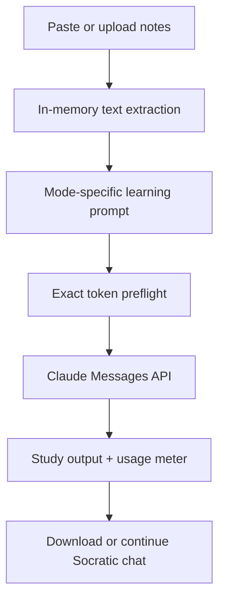

# Claude Study Companion

A responsible study assistant that turns a student's own lecture notes into structured
summaries, practice questions, layered explanations, and Socratic guidance.

Built with **Python**, **Streamlit**, and the official **Claude API**. The project is designed
as a one-day MVP for a campus-focused AI portfolio: useful enough to demo, small enough to
understand, and explicit about cost, privacy, and academic responsibility.

## What students can do

- Upload TXT, Markdown, PDF, Word, or PowerPoint notes, or paste text directly.
- Generate a structured key-point summary with formulas, connections, and common mistakes.
- Build a mixed practice set while keeping the answer key hidden until the student opens it.
- Ask for a concept explanation that progresses from intuition to technical detail.
- Enter Socratic Mode, where Claude asks one question at a time and offers hints before a
  student explicitly requests a reveal.
- Choose the output language and study level.
- Download every result as Markdown.

## Responsible-by-design features

- **Exact preflight budget:** the app calls Claude's token-counting endpoint before every
  generation and enforces the chosen input-token limit.
- **Output ceiling:** `max_tokens` is user-controlled and capped in the UI.
- **Visible usage:** actual input/output tokens, a per-session request meter, and an estimated
  model cost are shown after generation.
- **Secret isolation:** API keys come from Streamlit secrets, environment variables, or an
  optional password input. Real secret files are ignored by Git.
- **Prompt-injection boundary:** uploaded notes are explicitly treated as untrusted content,
  not as system instructions.
- **Source grounding:** prompts require Claude to flag missing information and distinguish
  note-based content from general background.
- **Learning-first interaction:** Socratic Mode defaults to diagnosis and small hints rather
  than immediately completing the student's work.
- **In-memory parsing:** the app does not write uploaded files into the repository.

> AI output can still be wrong. Students should verify formulas, definitions, and assessment
> requirements against their lecturer's materials.

## Architecture



```text
claude-study-companion/
├── app.py                     # Streamlit UI and session flow
├── src/
│   ├── claude_service.py      # Claude SDK wrapper and safe errors
│   ├── config.py              # limits, model labels, cost estimates
│   ├── documents.py           # TXT/MD/PDF/DOCX/PPTX extraction
│   ├── prompts.py             # grounded prompts for all four modes
│   └── study.py               # token budgeting and output helpers
├── tests/                     # unit and secret-safety tests
├── examples/                  # no-cost demo lecture note
├── docs/                      # Chinese setup guide, QA list, demo script
├── .streamlit/                # theme and safe secrets template
├── .vscode/                   # launch, testing, and extension setup
└── .github/workflows/         # GitHub Actions checks
```

## Quick start

### 1. Requirements

- Python 3.10 or newer (Python 3.12 recommended)
- A Claude API key from the [Anthropic Console](https://console.anthropic.com/settings/keys)
- VS Code is optional but preconfigured

### 2. Create the environment

Windows PowerShell:

```powershell
py -3.12 -m venv .venv
.\.venv\Scripts\python -m pip install --upgrade pip
.\.venv\Scripts\python -m pip install -r requirements-dev.txt
```

macOS/Linux:

```bash
python3.12 -m venv .venv
.venv/bin/python -m pip install --upgrade pip
.venv/bin/python -m pip install -r requirements-dev.txt
```

### 3. Add the key safely

Copy the template, then edit the new file:

```powershell
Copy-Item .streamlit\secrets.toml.example .streamlit\secrets.toml
```

```toml
ANTHROPIC_API_KEY = "your_real_key_here"
CLAUDE_MODEL = "claude-haiku-4-5-20251001"
```

`.streamlit/secrets.toml` is already in `.gitignore`. Never paste the key into `app.py`, a
screenshot, an issue, or a commit.

Alternatively, leave the server secret unset. The app will display a password field and use
the visitor's key for that session (BYOK mode).

### 4. Run

```powershell
.\.venv\Scripts\python -m streamlit run app.py
```

Open the local URL shown in the terminal, normally `http://localhost:8501`. Click **Use demo
notes** to test with a short Probability and Statistics example.

In VS Code, you can also open **Run and Debug** and select **Streamlit: Claude Study
Companion**.

## Test without spending API credits

The automated tests mock the Claude call; they do not use an API key or make paid requests.

```powershell
.\.venv\Scripts\python -m pytest
.\.venv\Scripts\python -m ruff check .
.\.venv\Scripts\python -m compileall -q app.py src tests
```

See [docs/TESTING_CHECKLIST.md](docs/TESTING_CHECKLIST.md) for the short manual QA pass that
does use Claude.

## Token and cost controls

The sidebar provides:

| Control | Default | Purpose |
| --- | ---: | --- |
| Input-token cap | 12,000 | Prevents a large note/history from creating an unexpectedly large request |
| Output-token cap | 1,200 | Limits maximum response length |
| Session request cap | 12 | Reduces accidental repeated calls in one Streamlit session |
| Socratic history window | 8 messages | Stops the multi-turn prompt from growing without bound |
| File limit | 5 × 8 MB | Limits parsing load; PDF extraction also stops after 80 pages |

If a note exceeds the input cap, the app samples labelled excerpts across the source and warns
the user. This is predictable and economical, but it can miss details. For a high-stakes or
complete summary, split the lecture by topic instead.

Cost estimates use the price table in `src/config.py`. Pricing can change, so confirm the
[current Claude model pricing](https://platform.claude.com/docs/en/about-claude/pricing) before
publishing cost claims.

## Model choice

- `claude-haiku-4-5-20251001` is the budget-oriented default.
- `claude-sonnet-5` is available in the selector for stronger reasoning.
- Set `CLAUDE_MODEL` if your account uses another supported model. Unknown models work, but
  the UI will not guess their cost.

The current model list and IDs are documented in Anthropic's
[models overview](https://platform.claude.com/docs/en/models/overview).

## Put it on GitHub

Create an empty repository named `claude-study-companion` on GitHub. Do not pre-add a README,
license, or `.gitignore`, then run:

```powershell
git init
git add .
git status
git commit -m "Build Claude Study Companion MVP"
git branch -M main
git remote add origin https://github.com/YOUR_USERNAME/claude-study-companion.git
git push -u origin main
```

Before `git commit`, confirm that `.streamlit/secrets.toml` is absent from `git status`.
GitHub Actions will run linting, tests, and bytecode compilation on every push and pull request.

The full Windows/VS Code walkthrough is in
[docs/GITHUB_VSCODE_GUIDE_CN.md](docs/GITHUB_VSCODE_GUIDE_CN.md).

## Deployment choices

### Safe public demo: BYOK (recommended for this MVP)

Deploy without `ANTHROPIC_API_KEY`. Each visitor enters their own key in the password field.
This prevents strangers from spending your API balance. The trade-off is extra setup for the
visitor.

### Controlled/private demo: server key

Add `ANTHROPIC_API_KEY` in the hosting platform's secret manager, never in the repository. The
app hides the key, but a public visitor can still consume it indirectly by sending requests.
The in-session limit is a usability guard, not robust authentication or global rate limiting.
Use a private app, real authentication, and a server-side quota store before funding a public
demo with your key.

For Streamlit Community Cloud, select this repository and `app.py`, then copy only the required
values into the platform's **Secrets** settings. See Streamlit's
[secrets guide](https://docs.streamlit.io/develop/concepts/connections/secrets-management).

## Known MVP limitations

- Scanned/image-only PDFs need OCR before upload.
- Charts and images embedded in documents are not interpreted; only extractable text is used.
- Token-budget sampling is not a substitute for a full map-reduce summarisation pipeline.
- The request limit resets with a new Streamlit session.
- Cost shown in the UI is an estimate and does not include discounts, caching, or future price
  changes.

## Next improvements

1. Add authenticated users plus persistent per-user quotas.
2. Add OCR and native image/PDF understanding for diagrams.
3. Store opt-in study sets and spaced-repetition progress.
4. Evaluate output quality with a small lecturer-reviewed Probability and Statistics benchmark.
5. Add prompt caching or section-by-section map-reduce for long notes.

## Why this project

The concept connects practical Claude API development with experience teaching Probability and
Statistics. It demonstrates a concrete student problem, a working AI interaction, measurable
resource controls, and a learning design that encourages thinking rather than answer copying.

## License

MIT. See [LICENSE](LICENSE).

This is an independent educational project and is not an official Anthropic product.
